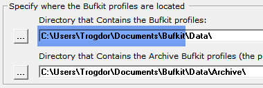
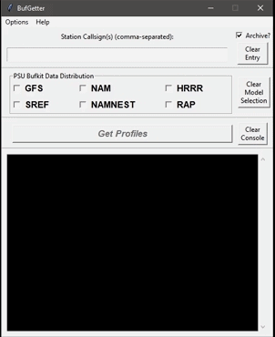
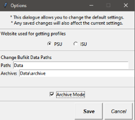

# BufGetter v1.02

- A [Bufkit](https://training.weather.gov/wdtd/tools/BUFKIT/) companion and alternative to BufGet enabling rapid and dynamic forecast profile retrieval.
- This is a Python tkinter zipapp.

### Contents
* [Fixes in this Version](#fixes-in-this-version)
* [Features](#feature-overview)
* [Installation](#installation)
* [How to Use](#how-to-use)
* [Note on Source Site Differences](#note-on-source-site-differences)
* [Modify Default Settings](#modify-default-settings)
* [Future Update Ideas](#future-update-ideas)
* [Credits/Links](#credits)

### Fixes in this Version

#### v1.02
- fixed a horrible flaw in trying to save an archive file. It was a total mistake in my code. It should work well now though

#### v1.01 (unavailable)
- Improved Settings change dialog
  - Prior to this update, the dialog wouldn't close correctly one didn't use the button widget for that purpose.
- Fixed inoperability in the last uploaded (but now discarded) version: I forgot to uncomment the `.mainloop()` method call!
  - I didn't bother to archive that version
- Fixed retrieval issues (dynamic-url creation) for ISU Bufkit Warehouse site.

[&#8679; back to Contents](#contents)

### Feature Overview
- Quickly retrieve the latest bufkit soundings files (`.buf`) by assembling a list of stations, and marking which weather models you'd like to get.
  - This will save a lot of time over using `BufGet` as there are no 'profiles' to edit/save/load.
- Generates bufkit-compatible archive files.
- This app uses data from the PSU Bufkit Data Distribution website and/or the ISU Bufkit Warehouse. You can change/save the site-selection according to your preference.

[&#8679; back to Contents](#contents)

### Installation

- This program is a Python tkinter zipapp. As such, you obviously need a Python installation (v3.5 or later), and have tkinter installed with it. Otherwise, this ain't gonna work.
- Download `BufGetter.pyz`. It is intended to be placed in the the default Bufkit Data folder. To find out what this directory is, open Bufkit and click `Set Up` in the top-right corner.

  - Example: if the Folder that holds the bufkit profiles is `C:/Users/Trogdor/Documents/Bufkit/Data/`, you'd want to place `BufGetter.pyz` in `C:/Users/Trogdor/Documents/Bufkit`
  - The program's default behavior is to save downloads to that `Data` folder.
  - As the standard directory for archived data is in the `Data/Archives` folder, the default archive path will be just that.
- You're now ready to run `BufGetter`. You should be able to double-click the `pyz` and open-up the program.
  - If you don't want to put `BufGetter.pyz` in the same place as your Bufkit data or want to keep it in its own directory, you can manually change the Bufkit data save paths in [BufGetter's options/settings](#modify-default-settings).

[&#8679; back to Contents](#contents)

### How to Use

1) In the entry box, type-in the station(s) that you want to retrieve data for. Multiple stations should be comma-separated (the program can also interpret space-separated if you find that more convenient).
2) Remember to check/uncheck the archive option (on the right) reflecting your aim. In this version, by default it is turned off, but I would highly recommend to change that setting.
3) Select the models that you want to download.
4) Click `Get Profiles`.

[&#8679; back to Contents](#contents)

### Note on Source Site Differences

- The user can change the site-source for downloading via the options menu.
- This program utilizes the core websites dedicated to providing up-to-date bufkit profiles: PSU and ISU (Bufkit Warehouse).
- Both websites offer `GFS`, `NAM`, `HRRR`, and `RAP` weather models.
- PSU offers `NAMNEST` and `SREF`.
- ISU offers `NAM4KM`.
- ISU's GFS and NAM models have a slight difference from PSU. ISU's site separates most-recent data in 00z/12z and 06z/18z folders.
- ISU's `NAM4KM` offering is not available as a 'most-recent' upload. Instead, what this program does is attempt to get the latest archived version from the Bufkit Warehouse Archives via guessing the URL of the most-recent version (for example, if it's 20z, the 12z model-run will be attempted to be grabbed because the 18z run probably wouldn't be available until 23z or so).

[&#8679; back to Contents](#contents)

### Modify Default Settings

- Select `Options`, then `Change Default Settings`. Here you can change the default website option (PSU or ISU), change the file paths to match your Bufkit Configuration settings, or indicate default archive file creation (this option doesn't download the file twice, so no extra data is used).

[&#8679; back to Contents](#contents)

### Future Update Ideas
- [ ] Archive-Only option (saves only the archive-compatible version)
- [ ] Date-based requests to enable full use of the Bufkit Warehouse Archive
- [ ] Select All Models Button

[&#8679; back to Contents](#contents)

### Credits
- [PSU Bufkit Data Distribution](http://www.meteo.psu.edu/bufkit/about.html)
- [ISU Bufkit Warehouse](http://www.meteor.iastate.edu/~ckarsten/bufkit/data/)

[&#8679; back to Contents](#contents)

